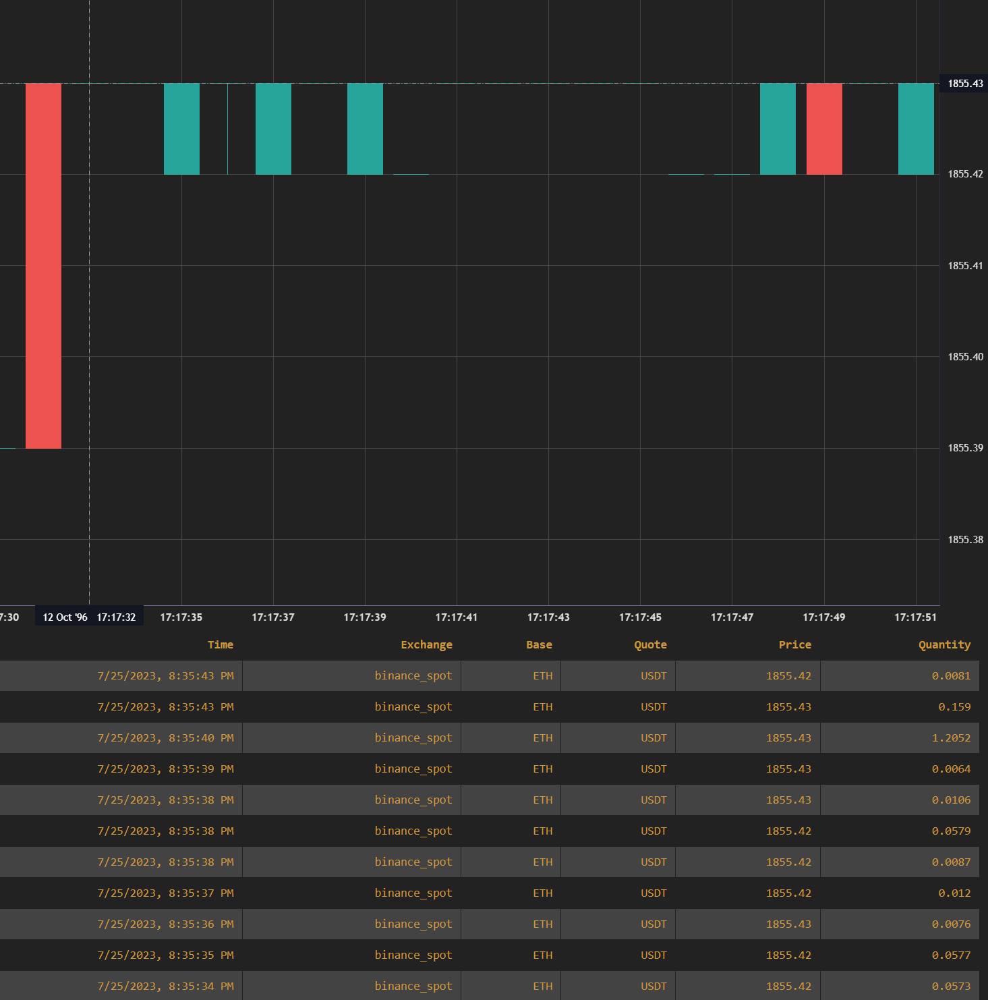

# ScyllaDB demo with Binance L2 Order Books

This is a demo of ScyllaDB with [Binance L2 Order Books](https://www.binance.com/en/support/faq/understanding-order-book-and-market-depth-da311403b10347f09ff783a2525c8aa6). 
It is a simple binary that charts bid or ask price depth for a given pair.

## Example Output

    cargo run -p scylladb-order-book-rs btc usdt

## Usage

To build:

    make build

To create database

    make up

To migrate database

    make migrate

To run the demo

    make run

To reset the database

    make reset

To destroy the database

    make down

## Dependencies

* [ScyllaDB](https://www.scylladb.com/)
* [Rust](https://www.rust-lang.org/)
* [Docker](https://www.docker.com/)
* [Docker Compose](https://docs.docker.com/compose/)
* [GNU Make](https://www.gnu.org/software/make/)
