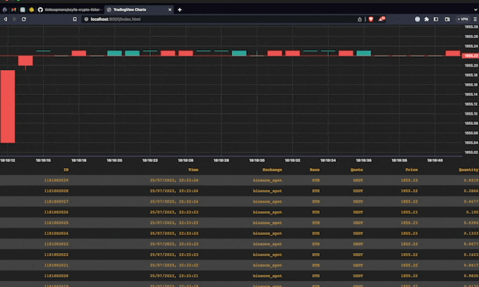

# ScyllaDB Crypto Ticker

This is a demo of ScyllaDB with [Binance websocket market streams](https://binance-docs.github.io/apidocs/spot/en/#websocket-market-streams). 
It is a simple binary that charts live prices at 2 second resolution for a given pair.

## Example Output

## Usage

To run the demo, first bring up the database:

    docker-compose up --detach scylla

Then run the demo application:

    docker-compose pull ticker
    docker-compose up --no-build ticker

You should then be able to view the demo at http://localhost:8000/index.html

## Development

To build:

    make build

To migrate database:

    make migrate

To run the demo application locally:

    make run

To reset the database:

    make reset

To tear it all down:

    make down

## Dependencies

* [ScyllaDB](https://www.scylladb.com/)
* [Rust](https://www.rust-lang.org/)
* [Docker](https://www.docker.com/)
* [Docker Compose](https://docs.docker.com/compose/)
* [GNU Make](https://www.gnu.org/software/make/)
